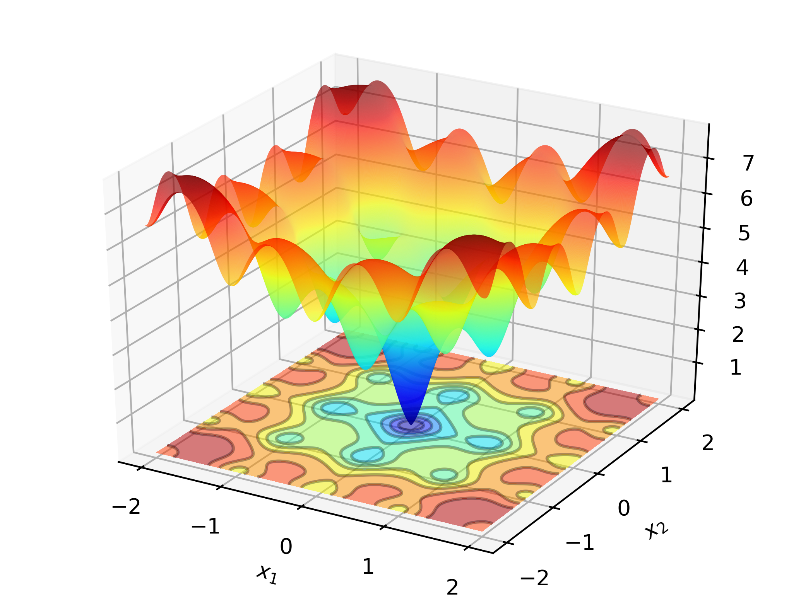

<!-- README.md is generated from README.Rmd. Please edit that file -->

```{r, include = FALSE}
knitr::opts_chunk$set(
  collapse = TRUE,
  comment = "#>",
  fig.path = "man/figures/README-",
  out.width = "100%"
)
```

# optimLibR

<!-- badges: start -->
  [](https://github.com/StateOfTheR/optimLibR/actions)
  [](https://www.tidyverse.org/lifecycle/#experimental)
  [](https://github.com/StateOfTheR/optimLibR/commits/master)
<!-- badges: end -->

## Description

An R wrapper for the [optimlib library](https://github.com/kthohr/optim).

## Installation

You can install the released version of optimLibR from [CRAN](https://CRAN.R-project.org) with:

``` r
install.packages("optimLibR")
```

## Motivations

  1. Apprendre à interfacer une librarie C++ avec R en l'intégrant dans un package
    - Définition des règles de compilation
    - Utilisation de méthodes d'optimisation alternatives
  2. Disposer des implémentations alternative des méthodes d'optimisation classiques 
  3. Disposer d'implémentation de méthodes non présentes dans `optim`, comme ADAM

## La bibliothèque `optimLib`

Il s'agit d'une [bibliothèque C++ développée par Keith O'hara ](https://github.com/kthohr/optim), incluant les algorithmes d'optimisation suivants:

* Broyden's Method (for root finding)
* Newton's method, BFGS, and L-BFGS
* Gradient descent: basic, momentum, Adam, AdaMax, Nadam, NadaMax, and more
* Nonlinear Conjugate Gradient
* Nelder-Mead
* Differential Evolution (DE)
* Particle Swarm Optimization (PSO)

L'appel aux algorithmes se fait de la manière suivante en C++

```{cpp}
algorithm_name(<initial and final values>, <objective function>, <objective function data>);
```

## Réalisation

Nous avons proposé une première version d'un [package R **optimLibR** intégrant de manière minimale la librarie C++](https://github.com/StateOfTheR/optimLibR)

```{r}
library(optimLibR)
```

Pour ce faire, le code source de la bibliothèque **optimLib** est intégré sous forme de ".hpp" (header only") dans le répertoire `inst/include` du package. Il suffit ensuite de déclarer correctement les variables de compilation dans les fichiers `Makevars` du répertoire ` src`.

```{bash, eval = FALSE}
PKG_CXXFLAGS = $(SHLIB_OPENMP_CXXFLAGS) -I../inst/include -DUSE_RCPP_ARMADILLO
PKG_LIBS= $(SHLIB_OPENMP_CXXFLAGS) $(LAPACK_LIBS) $(BLAS_LIBS) $(FLIBS)
CXX_STD = CXX11
```

## Tests d'utilisation

Nous avons intégré au package les deux fonctions de tests C+++ proposée par Keith O'hara, placé dans le répertoire `src`

### Ackley function

Consider searching for the global minimum of the [Ackley function](https://en.wikipedia.org/wiki/Ackley_function):



This is a well-known test function with many local minima. Newton-type methods (such as BFGS) are sensitive to the choice of initial values, and will perform rather poorly here. As such, we will employ a global search method; in this case: Differential Evolution.


```{r ackley, cache = TRUE}
ackley_function()
```

Avec les méthodes intégrées dans la fonction `optim`, la qualité de la minimisation est variable, selon la recherche d'un optimum local ou global et du point de départ:

```{r ackely with optim}
ackley <- function(x0) {
    x <- x0[1]
    y <- x0[2]
    res <- -20*exp( -0.2*sqrt(0.5*(x*x + y*y)) ) - exp( 0.5*(cos(2*pi*x) + cos(2*pi*y)) ) + 20 + exp(1)
    res
}

x0 <- c(-1,1)
optim(x0, ackley, method = "Nelder-Mead")$par
optim(x0, ackley, method = "SANN")$par
optim(x0, ackley, method = "L-BFGS-B")$par
optim(x0, ackley, method = "BFGS")$par
```

### Logistic regression

For a data-based example, consider maximum likelihood estimation of a logit model, common in statistics and machine learning. In this case we have closed-form expressions for the gradient and hessian. We will employ a popular gradient descent method, Adam (Adaptive Moment Estimation), and compare to a pure Newton-based algorithm.

```{r logit, cache = TRUE}
logit_optimLib()
```

## TODO / À faire

L'idée serait de développer une interface complète R/C++ avec chacun des algorithme implémenté dans optimLib, à la manière du [package **nloptr** par exemple](https://cran.r-project.org/web/packages/nloptr/index.html).


